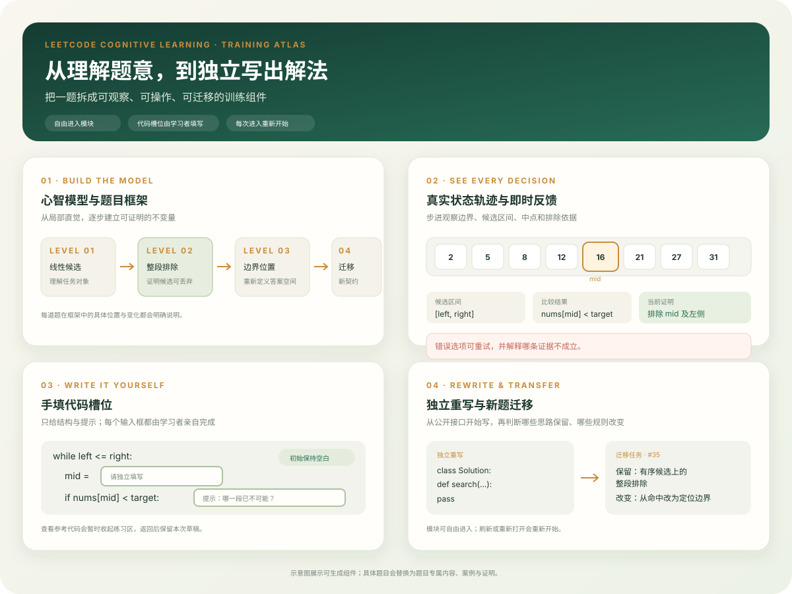
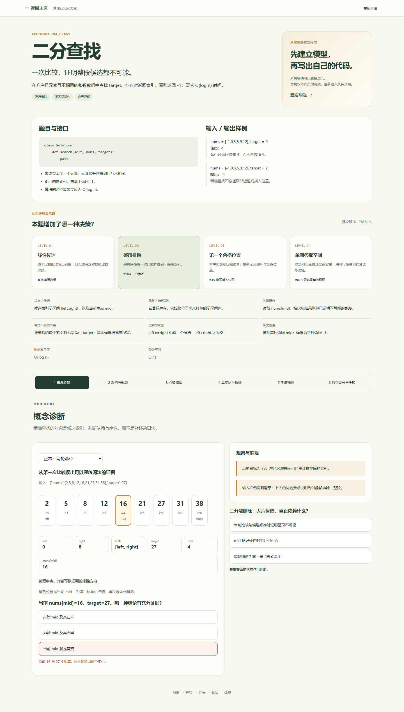

# LeetCode 高效学习 HTML

把一道 LeetCode 题生成一个可以离线打开的中文交互学习页面：先建立心智模型，再观察反例和真实状态轨迹，随后手填代码槽位、独立重写，最后完成迁移训练。



组件示意图展示了技能可生成的交互类型。每道题会使用自己的心智模型、案例和证明内容；不会把示例题的算法套用到新题。

## 页面示例

以下截图来自本技能生成的 [LeetCode 704 二分查找示例](examples/leetcode_704_learning.html)。桌面版展示题目契约、认知梯度、心智模型和交互判断；手机截图展示窄屏下的重新排版。

| 桌面页面：题目框架与交互判断 | 手机页面：响应式布局 |
| --- | --- |
|  |  |

示例 HTML 是单文件，可离线打开，不需要启动服务器。完整页面还包含真实运行轨迹、手填代码槽位、参考复习、独立重写与迁移训练。

## 支持哪些编程助手

这个技能本质上是一个“文件夹 + Markdown 规则 + Python/Node 脚本”，不依赖某一个 AI 编辑器。它可以用于：

- Codex：将技能目录安装到 `C:\Users\<用户名>\.codex\skills\leetcode-learning-html`，然后在对话中说 `使用 $leetcode-learning-html，把 LeetCode 704 生成学习 HTML`。
- Claude Code：把整个目录复制到项目的 `.claude/skills/leetcode-learning-html/`，或复制到个人 skills 目录；在 `CLAUDE.md` 中写入“生成 LeetCode 学习页面时读取该目录的 SKILL.md”，然后直接提出题目请求。
- Trae：把目录放在项目中，例如 `.trae/skills/leetcode-learning-html/`，在项目规则中引用 `SKILL.md`；也可以直接运行下面的命令生成页面，再让 Trae 检查和修改 `lesson.json`。
- Cursor、Cline、Aider 及其他编译器：将 `SKILL.md`、`references/`、`assets/` 和 `scripts/` 一起放入项目，要求助手先阅读 `SKILL.md`，再按命令行流程工作。
- 纯命令行：不需要 AI 助手，直接准备 `lesson.json`，运行构建脚本即可。

技能目录可以放在项目中，也可以放在各工具的个人规则目录。不要只复制 `SKILL.md`；模板和验证脚本也需要一起复制。

## 最简单的使用方式

对支持技能的助手直接说：

```text
使用 $leetcode-learning-html，把 LeetCode 226 翻转二叉树生成一份中文、Python、可离线打开的学习 HTML。
要求：包含树结构动画、非对称反例、手填槽位、独立重写和迁移到对称二叉树。
```

也可以给题目链接或完整题面：

```text
请把 https://leetcode.com/problems/search-insert-position/ 生成认知训练页面。
槽位必须为空，所有模块自由进入，不保存学习历史，输出到 output/leetcode_35.html。
```

只有题号时，助手需要先确认题意、约束和签名；无法确认的题面不应被编造。

## 命令行流程

先创建一个 `lesson.json`。字段格式见 [`references/content-schema.md`](references/content-schema.md)。然后执行：

```powershell
python scripts/build_lesson.py lesson.json --output output/leetcode_704.html
node scripts/verify_lesson.cjs output/leetcode_704.html
```

如果页面需要返回课程主页，可加一个相对于输出文件的本地路径：

```powershell
python scripts/build_lesson.py lesson.json --output output/leetcode_704.html --home ../index.html
```

修改模板或构建器后运行单元检查：

```powershell
python scripts/test_builder.py
```

生成一个完整的 #704 演示页面：

```powershell
python scripts/demo_binary_search.py --output-dir output
node scripts/verify_lesson.cjs output/leetcode_704_learning.html
```

`build_lesson.py` 会校验六个学习模块、案例帧、图节点、槽位绑定、答案不泄露和 Python 代码语法。`verify_lesson.cjs` 会在浏览器中检查模块逆序进入、轨迹前进后退、普通答题不打开参考、槽位初始为空、草稿保留、重新载入清空，以及 390px/1440px 布局。

## 页面默认行为

- 代码槽位和独立编辑器不预填答案。
- 参考代码与练习编辑器分开，查看参考不会完成训练。
- 普通选项使用明确的动作标记，按钮文字包含“答案”不会自动被当作参考入口。
- 学习模块和迁移模块自由进入。
- 学习状态只存在当前页面内；刷新或重新进入会重新开始。
- 错误选择可以重试，不会自动替换成正确答案。

详细设计规则见 [`references/teaching-design.md`](references/teaching-design.md)，交付前检查见 [`references/verification.md`](references/verification.md)。

## 项目结构

```text
leetcode-learning-html/
├── SKILL.md
├── README.md
├── agents/openai.yaml
├── assets/lesson-shell.html
├── assets/lesson.css
├── assets/lesson.js
├── assets/component-atlas.svg
├── assets/example-704.png
├── assets/example-704-mobile.png
├── examples/leetcode_704_learning.html
├── examples/lesson.json
├── references/
└── scripts/
```

本技能抽取自算法认知实验室中的数组、链表、树、二分、图和动态规划页面；它提取的是可迁移的教学机制，不会把 #704 的算法模板硬套到其他题目。
